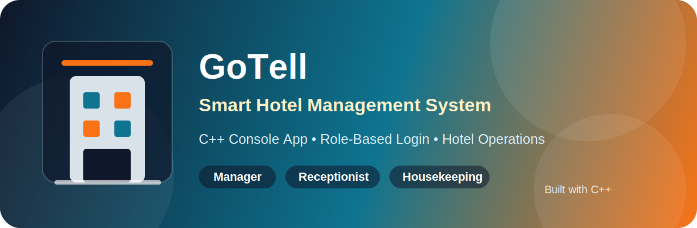

# 🏨 GoTell — Smart Hotel Management System



GoTell adalah aplikasi manajemen hotel berbasis **console (CLI)** yang dibuat menggunakan **C++**. Aplikasi ini mensimulasikan tiga peran utama dalam operasional hotel: **Manager**, **Resepsionis**, dan **Housekeeping**, lengkap dengan navigasi menu interaktif menggunakan tombol panah (↑ / ↓ / Enter), sistem check-in/check-out, layanan tambahan, dan pembayaran via **Tunai** atau **QRIS**.

---

## 📌 Daftar Isi
- [Tentang Proyek](#-tentang-proyek)
- [Fitur Utama](#-fitur-utama)
- [Konsep C++ yang Digunakan](#-konsep-c-yang-digunakan)
- [Struktur Data yang Di-set di Program](#-struktur-data-yang-di-set-di-program)
- [Alur Program](#-alur-program)
- [Cara Menjalankan](#-cara-menjalankan)
- [Library yang Digunakan](#-library-yang-digunakan)
- [Rumus Perhitungan](#-rumus-perhitungan)
- [Pembagian Tugas Tim (7 Anggota)](#-pembagian-tugas-tim-7-anggota)
- [Galeri / Screenshot](#-galeri--screenshot)

---

## 📖 Tentang Proyek

GoTell dibangun sebagai studi kasus penerapan konsep dasar C++ (struct, array, fungsi, pointer, dan looping) dalam sebuah sistem yang menyerupai aplikasi nyata. Tampilan CLI dibuat semirip mungkin dengan aplikasi modern: ada banner ASCII art, kotak menu yang bisa dinavigasi dengan tombol panah, warna teks (ANSI color), animasi loading, hingga struk transaksi dan kode QRIS visual.

---

## ✨ Fitur Utama

| Role | Fitur |
|------|-------|
| **Manager** | Dashboard pendapatan, lihat semua kamar, lihat transaksi aktif, laporan pendapatan detail, statistik okupansi per tipe kamar |
| **Resepsionis** | Check-in tamu, tambah layanan ke tamu, check-out tamu (pembayaran Tunai/QRIS), lihat semua kamar, lihat transaksi aktif |
| **Housekeeping** | Lihat status semua kamar, selesaikan pembersihan kamar, set kamar ke maintenance, selesaikan maintenance |

Fitur tambahan:
- Navigasi menu pakai tombol **ATAS / BAWAH / ENTER** (mirip aplikasi modern), dengan `getch()` dari `<conio.h>` sehingga versi utama ditujukan untuk **Windows**.
- Struk transaksi otomatis (rincian kamar, layanan, pajak 11%, service charge 5%).
- Pembayaran **QRIS** menampilkan header dan ilustrasi QR berbasis karakter sebagai simulasi, bukan kode QRIS asli.
- Tabel (daftar kamar tersedia & daftar layanan) diberi indentasi rata dengan input pengguna serta baris kosong pemisah agar tampilan lebih rapi.

> Catatan: Program ini memakai `<conio.h>` dan `system("cls")`, jadi paling aman dijalankan di Windows. Untuk Linux/Mac, perlu penyesuaian pada bagian input tombol dan clear screen.

---

## 🧠 Konsep C++ yang Digunakan

- **STRUCT** → `Kamar`, `Tamu`, `Layanan`, `Transaksi`, `User`
- **ARRAY** → `daftarKamar[]`, `daftarUser[]`, `daftarTamu[]`, `daftarLayanan[]`, `daftarTransaksi[]` (ukuran tetap/statis)
- **FUNGSI** → hampir seluruh proses dipecah menjadi fungsi-fungsi kecil agar modular
- **POINTER** → fungsi pencarian (`cariKamar`, `cariUser`, `cariTamuByKTP`, `cariLayanan`, `cariTransaksiAktif`) mengembalikan pointer ke elemen array, sehingga data bisa diubah langsung lewat pointer tersebut
- **LOOPING** → `for` untuk membaca/menampilkan array, `while`/`do-while` untuk navigasi menu & validasi input

---

## 🗂 Struktur Data yang Di-set di Program

Data berikut sudah di-*hardcode* (inisialisasi) di dalam program lewat fungsi `inisialisasiKamar()`, `inisialisasiUser()`, dan `inisialisasiLayanan()`:

### Daftar Kamar (14 kamar)
| No | Tipe | Lantai | Kapasitas | Harga/Malam |
|----|------|--------|-----------|--------------|
| 101–105 | Standard | 1 | 2–3 org | Rp 450.000 – Rp 550.000 |
| 201–204 | Deluxe | 2 | 2–3 org | Rp 750.000 – Rp 950.000 |
| 301–303 | Suite | 3 | 2–4 org | Rp 1.500.000 – Rp 1.800.000 |
| 401–402 | Presidential | 4 | 4–6 org | Rp 4.500.000 – Rp 5.000.000 |

### Daftar Akun (5 user)
| Username | Password | Nama | Role |
|----------|----------|------|------|
| manager | manager123 | Iqbal | Manager |
| resep1 | resep123 | Adji | Resepsionis |
| resep2 | resep456 | Zhyla | Resepsionis |
| hk1 | hk123 | Nurra | Housekeeping |
| hk2 | hk456 | Wira | Housekeeping |

### Daftar Layanan (10 layanan)
| ID | Nama Layanan | Harga |
|----|--------------|-------|
| FB-01 | Sarapan Pagi (Buffet) | Rp 85.000 |
| FB-02 | Room Service 24 Jam | Rp 50.000 |
| FB-03 | Makan Malam Romantis | Rp 350.000 |
| SP-01 | Pijat Tradisional | Rp 250.000 |
| SP-02 | Spa Pasangan | Rp 750.000 |
| LN-01 | Laundry Express | Rp 50.000 |
| TR-01 | Antar Jemput Bandara | Rp 200.000 |
| TR-02 | City Tour Setengah Hari | Rp 350.000 |
| EN-01 | Karaoke 1 Jam | Rp 150.000 |
| BS-01 | Sewa Meeting Room | Rp 500.000 |

> Pajak: **11%**, Service Charge: **5%** dari subtotal (harga kamar + layanan).

---

## 🔄 Alur Program

```
mulai
  │
  ▼
[ Banner GoTell ] → [ Login (max 3x percobaan) ]
  │
  ├── Gagal 3x → program berhenti
  │
  ▼
[ Cek role user ]
  │
  ├── Manager ──────► Menu Manager
  │                     ├─ Dashboard Utama
  │                     ├─ Lihat Semua Kamar
  │                     ├─ Lihat Transaksi Aktif
  │                     ├─ Laporan Pendapatan
  │                     ├─ Statistik Okupansi
  │                     └─ Logout
  │
  ├── Resepsionis ──► Menu Resepsionis
  │                     ├─ Check-in Tamu
  │                     ├─ Tambah Layanan ke Tamu
  │                     ├─ Check-out Tamu (Tunai / QRIS)
  │                     ├─ Lihat Semua Kamar
  │                     ├─ Lihat Transaksi Aktif
  │                     └─ Logout
  │
  └── Housekeeping ─► Menu Housekeeping
                        ├─ Lihat Semua Status Kamar
                        ├─ Selesaikan Pembersihan Kamar
                        ├─ Set Kamar ke Maintenance
                        ├─ Selesaikan Maintenance
                        └─ Logout
  │
  ▼
[ Login user lain? (y/n) ]
  │
  ├── y → kembali ke Login
  └── n → program selesai
```

Alur **Check-Out** secara khusus:
```
Check-Out → Input nomor kamar → Tampilkan struk
   → Pilih metode bayar (Tunai / QRIS)
        ├─ Tunai  → langsung lanjut
        └─ QRIS   → tampilkan header & kode QR → tekan tombol lanjut
   → Transaksi ditandai "Selesai" → kamar jadi "Dibersihkan"
```

---

## 🚀 Cara Menjalankan

Program ini direkomendasikan dijalankan di **Windows**, karena memakai `<conio.h>` untuk membaca tombol tanpa menekan Enter dan `system("cls")` untuk membersihkan layar.

**Windows (MinGW/g++):**
```bash
g++ -std=c++17 -o GoTell.exe GoTell.cpp
GoTell.exe
```

Jika nama file berbeda, sesuaikan bagian `GoTell.cpp` dengan nama file program kamu, misalnya:

```bash
g++ -std=c++17 -o GoTell.exe main.cpp
GoTell.exe
```

> Untuk Linux/Mac, program perlu disesuaikan terlebih dahulu karena `<conio.h>` bukan library standar di sistem tersebut.

---

## 📚 Library yang Digunakan

| Library | Fungsi dalam Program | Status |
|---------|----------------------|--------|
| `<iostream>` | Input dan output utama seperti `cin`, `cout`, dan `getline` | Wajib |
| `<iomanip>` | Merapikan tabel dan angka, seperti `setw`, `setfill`, `fixed`, dan `setprecision` | Wajib |
| `<string>` | Menggunakan tipe data `string` dan fungsi seperti `to_string` | Wajib |
| `<ctime>` | Mengambil tanggal saat ini untuk dashboard manager | Dipakai |
| `<sstream>` | Membantu menyusun format tanggal dengan `ostringstream` | Dipakai |
| `<cstdlib>` | Menjalankan `system("cls")`, `system("chcp 65001 > nul")`, dan `exit(0)` | Dipakai |
| `<thread>` | Membuat animasi loading dengan jeda | Opsional |
| `<chrono>` | Mengatur durasi jeda animasi loading | Opsional |
| `<conio.h>` | Membaca tombol panah dan Enter tanpa perlu menekan Enter (`getch()`) | Wajib untuk menu interaktif Windows |

`<thread>` dan `<chrono>` bisa dihapus jika animasi loading tidak memakai delay. Library lain sebaiknya tetap digunakan agar program stabil dan mudah dijalankan di compiler berbeda.

---

## 🧮 Rumus Perhitungan

### Total Pembayaran

Program menghitung total pembayaran dengan rumus:

```text
subtotal = biaya kamar + total layanan
pajak = subtotal × 11%
service charge = subtotal × 5%
grand total = subtotal + pajak + service charge
```

### Okupansi Kamar

Tingkat okupansi dihitung dari jumlah kamar yang sedang berstatus **Terisi** dibandingkan dengan total kamar:

```text
okupansi = jumlah kamar terisi / total kamar × 100%
```

Progress bar okupansi memakai simbol blok seperti `█` untuk bagian terisi dan `░` untuk bagian kosong, sehingga tampilannya lebih rapi dibandingkan simbol `#`.

---

## 👥 Pembagian Tugas Tim (7 Anggota)

Pembagian ini dibuat seolah-olah tim merakit ulang aplikasi ini dari nol (modul per modul), supaya tiap anggota benar-benar memahami dan bisa mempertanggungjawabkan bagiannya saat presentasi/demo.

| # | Anggota | Modul / Tanggung Jawab | Fungsi/Bagian Terkait |
|---|---------|--------------------------|-------------------------|
| 1 | **Iqbal Ganteng — Project Lead & Core Data Structures** | Merancang seluruh `struct` (Kamar, Tamu, Layanan, Transaksi, User), deklarasi array global & konstanta (MAX_*, PAJAK, SERVICE_CHARGE), serta menyatukan (merge) seluruh modul dari anggota lain di tahap akhir. | `struct Kamar/Tamu/Layanan/Transaksi/User`, deklarasi array & konstanta, `main()` |

| 2 | **Zhyla — Input/Output & Util Dasar** | Membuat fungsi pembacaan input yang aman (validasi & anti-EOF crash), fungsi util format (rupiah, tanggal, ID transaksi), dan fungsi layar (clear screen, garis pembatas). | `bacaTeks()`, `bacaAngka()`, `cekEOF()`, `clearScreen()`, `formatRupiah()`, `tanggalSekarang()`, `buatID()`, `garis()` |

| 3 | **Adji — UI Navigasi (Menu Interaktif)** | Membangun sistem navigasi tombol panah ATAS/BAWAH/ENTER menggunakan `getch()`, kotak menu otomatis, dan banner ASCII art GoTell. | `bacaTombolArah()`, `kotakMenu()`, `hitungLebarKotak()`, `pilihMenuKotak()`, `tampilkanBanner()`, `tungguTombol()`, `animasiLoading()` |

| 4 | **Nurra — Modul Data Master & Pencarian (Pointer)** | Mengisi data awal kamar/user/layanan (`inisialisasi...`), dan membuat seluruh fungsi pencarian berbasis pointer agar data bisa diubah langsung dari fungsi lain. | `tambahKamar()`, `inisialisasiKamar()`, `tambahUser()`, `inisialisasiUser()`, `tambahLayanan()`, `inisialisasiLayanan()`, `cariKamar()`, `cariUser()`, `cariTamuByKTP()`, `cariLayanan()`, `cariTransaksiAktif()`, `ambilOrTambahTamu()` |

| 5 | **Wirra — Modul Resepsionis (Transaksi)** | Mengerjakan seluruh alur transaksi tamu: check-in, tambah layanan, dan check-out termasuk logika pembayaran Tunai/QRIS dan tampilan struk. | `prosesCheckIn()`, `prosesTambahLayanan()`, `prosesCheckOut()`, `cetakStruk()`, `tampilkanHeaderQRIS()`, `hitungTotalAkhir()`, `menuResepsionis()` |

| 6 | **Sultan — Modul Housekeeping & Tampilan Kamar/Layanan** | Mengerjakan fitur housekeeping (set/selesai maintenance, pembersihan kamar) serta seluruh tampilan tabel kamar & layanan yang rapi (indentasi & spasi pemisah). | `prosesBersihkanKamar()`, `prosesSetMaintenance()`, `prosesSelesaiMaintenance()`, `menuHousekeeping()`, `tampilkanSemuaKamar()`, `tampilkanKamarTersedia()`, `tampilkanLayanan()`, `warnaStatusKamar()` |

| 7 | **Isam — Modul Manager & Laporan/Statistik** | Mengerjakan seluruh fitur manager: dashboard pendapatan, laporan pendapatan detail, dan statistik okupansi per tipe kamar (termasuk progress bar berbasis simbol). | `tampilkanDashboard()`, `tampilkanLaporanPendapatan()`, `tampilkanOkupansi()`, `menuManager()`, `tampilkanTransaksiAktif()`, `login()` |

> 💡 Saran kerja tim: setiap anggota membuat *branch* sendiri sesuai modulnya (`feature/resepsionis`, `feature/housekeeping`, dst), lalu di-*merge* oleh Anggota 1 (Project Lead) ke `main` setelah saling review.

---

## 🖼 Galeri / Screenshot

> Tambahkan file gambar dengan nama persis seperti di bawah ini ke dalam folder `assets/` pada repository, maka gambar akan otomatis tampil di README ini.

| Gambar | Keterangan | Path yang harus diisi |
|--------|------------|--------------------------|
| Header repo | Banner/header utama repository | `assets/header.jpg` |
| Banner aplikasi | Tampilan ASCII art banner GoTell saat program dibuka | `assets/banner.jpg` |
| Menu Login | Tampilan layar login | `assets/login.jpg` |
| Menu Manager | Tampilan kotak menu Manager | `assets/menu-manager.jpg` |
| Dashboard Manager | Tampilan dashboard pendapatan & okupansi | `assets/dashboard.jpg` |
| Menu Resepsionis | Tampilan kotak menu Resepsionis | `assets/menu-resepsionis.jpg` |
| Check-in | Tampilan proses check-in tamu | `assets/checkin.jpg` |
| Tambah Layanan | Tampilan proses tambah layanan ke tamu | `assets/tambah-layanan.jpg` |
| Struk & Metode Bayar | Tampilan struk + pilihan Tunai/QRIS | `assets/checkout-bayar.jpg` |
| QRIS | Tampilan header & kode QRIS | `assets/qris.jpg` |
| Menu Housekeeping | Tampilan kotak menu Housekeeping | `assets/menu-housekeeping.jpg` |
| Statistik Okupansi | Tampilan grafik okupansi per tipe kamar | `assets/okupansi.jpg` |

Contoh embed gambar di Markdown (sudah disiapkan, tinggal upload filenya):

```markdown


```

---

## 📄 Lisensi

Proyek ini dibuat untuk keperluan tugas/pembelajaran. Bebas dipakai dan dimodifikasi untuk keperluan edukasi.
